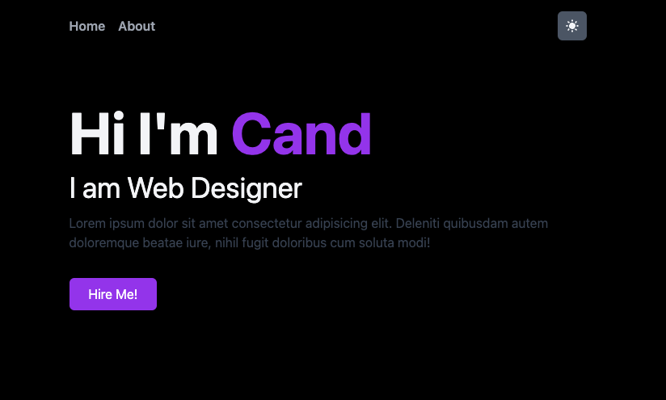

This is a [Next.js](https://nextjs.org/) project bootstrapped with [`create-next-app`](https://github.com/vercel/next.js/tree/canary/packages/create-next-app).

## Available Scripts

In the project directory, you can run:

### `yarn install`

Instal All dependencies in this project

### `yarn dev`

Runs the app in the development mode. 
Open [http://localhost:3000](http://localhost:3000) to view it in the browser.

### Link

Next js: https://nextjs.org/docs/getting-started
TailwindCSS: https://tailwindcss.com/docs/guides/nextjs
Next-Themes: https://github.com/pacocoursey/next-themes
HeroIcons: https://heroicons.com/

### Video Tutorial

You can see my youtube video for this project in [here](https://youtu.be/z2B3gRt2nj0)